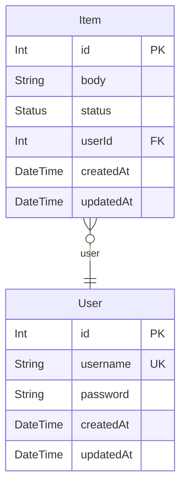

# sample
> Generated by [`prisma-markdown`](https://github.com/samchon/prisma-markdown)

- [ToDos](#todos)

## ToDos

### `User`
User model.

**Properties**
  - `id`: Primary Key. Auto-incremented.
  - `username`: Unique username.
  - `password`: Password.
  - `createdAt`: Created at.
  - `updatedAt`: Updated at.

### `Item`
Item model.

**Properties**
  - `id`: Primary Key. Auto-incremented.
  - `body`: Title of the item.
  - `status`: Status of the item.
  - `userId`: User ID.
  - `createdAt`: Created at.
  - `updatedAt`: Updated at.